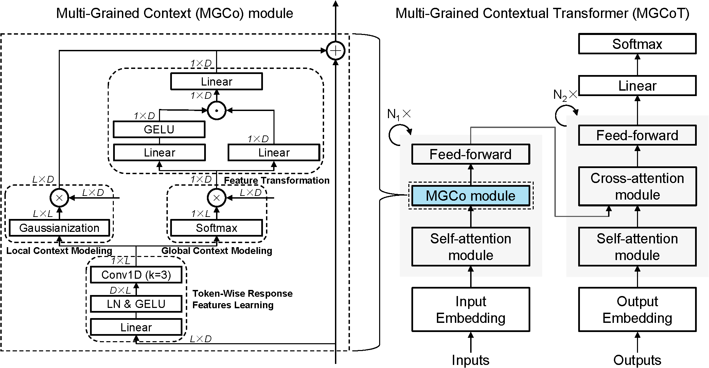

# MGCoT: Multi-Grained Contextual Transformer for Table-based Text Generation

## Overview


## Requirements
```bash
pip install -r requirements.txt
```

## Train
You can train your own model following these steps.

1. Download [Pre-trained T5 Model](https://huggingface.co/google-t5/t5-base/tree/main) and save it to the directory 'PLM/t5-base'

2. Train vanilla T5 model or Train MGCoT T5 Model
```bash
bash run-t5-base-fetaqa.sh
```
```bash
bash run-mgcot-t5-base-fetaqa.sh
```

After running the script, you will get trained model weights, training logs, and results in the output folder, including the predicted summaries in 'test_preds_seq2seq.txt'.
